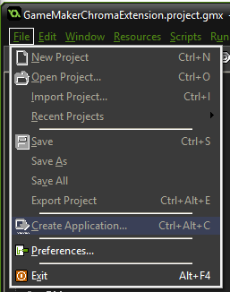
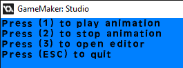

# GameMaker Chroma Extension - GameMaker Extension to control lighting for Razer Chroma

**Table of Contents**

* [Related](#related)
* [Frameworks supported](#frameworks-supported)
* [Getting Started](#getting-started)
* [Assets](#assets)
* [API](#api)
* [Examples](#examples)

<a name="related"></a>
## Related

- [CChromaEditor](https://github.com/RazerOfficial/CChromaEditor) - C++ Native MFC Library for playing and editing Chroma animations

- [GameMakerChromaExtension](https://github.com/RazerOfficial/GameMakerChromaExtension) - GameMaker Extension to control lighting for Razer Chroma

- [HTML5ChromaSDK](https://github.com/RazerOfficial/HTML5ChromaSDK) - JS Library for playing Chroma animations

- [UE4ChromaSDK](https://github.com/RazerOfficial/UE4ChromaSDK) - Unreal Engine 4 (UE4) Blueprint library to control lighting for Razer Chroma

- [UnityNativeChromaSDK](https://github.com/RazerOfficial/UnityNativeChromaSDK) - Unity native library for the ChromaSDK

- [UnityChromaSDK](https://github.com/RazerOfficial/UnityChromaSDK) - Unity C# library for the Chroma Rest API

<a name="frameworks-supported"></a>
## Frameworks supported
- GameMaker 1.4 [download](https://www.yoyogames.com/downloads/gm-studio/release-notes-studio.html)
- Windows

<a name="getting-started"></a>
## Getting Started

1 Import the [GameMakerChromaExtension.gmez](https://github.com/razerofficial/GameMakerChromaExtension/releases/tag/GMS_1_4) extension

2 Double-click the `ChromaSDK` extension


3 On the `Import Resources` tab, expand `Included Files`, select `CChromaEditorLibrary.dll` and click `Import All`


4 `CChromaEditorLibrary.dll` should appear in your project's `Included Files` folder
 


5 Double-click a `Chroma` animation to associate the `.chroma` extension with the [CChromaEditor](https://github.com/RazerOfficial/CChromaEditor)


6 Once associated, double-click a `Chroma` animation to bring up the animation editor


7 In order to see the lighting animations play, use the `File->Create Application` menu item to create a `Windows` application. After the installer completes, the application will play `Chroma` animations.
 


<a name="assets"></a>
## Assets

This extension supports the `Chroma` animation exports from [UE4](https://github.com/razerofficial/UE4ChromaSDK), [Unity](https://github.com/razerofficial/UnityNativeChromaSDK/), and [GameMaker](https://github.com/razerofficial/GameMakerChromaExtension).

Add `Chroma` animation files to the project's `Included Files` to make the animations accessible from `GMS` script.


<a name="api"></a>
## API

* [ScriptChromaCloseAnimationName](#ScriptChromaCloseAnimationName)
* [ScriptChromaInit](#ScriptChromaInit)
* [ScriptChromaCopyKeyColorName](#ScriptChromaCopyKeyColorName)
* [ScriptChromaGetFrameCountName](#ScriptChromaGetFrameCountName)
* [ScriptChromaInit](#ScriptChromaInit)
* [ScriptChromaOpenEditorDialog](#ScriptChromaOpenEditorDialog)
* [ScriptChromaPauseAnimationName](#ScriptChromaPauseAnimationName)
* [ScriptChromaPlayAnimationName](#ScriptChromaPlayAnimationName)
* [ScriptChromaPlayComposite](#ScriptChromaPlayComposite)
* [ScriptChromaResumeAnimationName](#ScriptChromaResumeAnimationName)
* [ScriptChromaSetKeyColorName](#ScriptChromaSetKeyColorName)
* [ScriptChromaStopComposite](#ScriptChromaStopComposite)
* [ScriptChromaUninit](#ScriptChromaUninit)


The extension methods are only available on the `Windows` platform. Use `GMS` to detect the `Windows` os.

```
if (os_type == os_windows)
{
   // do Chroma
}
```

When the first room loads, run GMS script to set the default global variables. These globals are what connects the `Chroma` DLL methods.

See [ScriptGlobals.gml](scripts/ScriptGlobals.gml).

The API has various methods with the `D` suffix where `double` return-type/parameters were used. This is to support engines like `GameMaker` which have a limited number of data-types.


<a name="ScriptChromaCloseAnimationName"></a>
**ScriptChromaCloseAnimationName**

The helper script closes an animation to reload from disk. The method takes a string parameter of the animation name.

```
animation = 'Random_Keyboard.chroma';
ScriptChromaCloseAnimationName(animation);
```


<a name="ScriptChromaCopyKeyColorName"></a>
**ScriptChromaCopyKeyColorName**

The helper script copies the key color from a source animation to the target animation for the key of the animation frame. The source and target animation are strings. The frame index is a number from 0 to the frame count. The key is a integer of the key number.

```
sourceAnimation = 'Fire_Keyboard.chroma';
targetAnimation = 'Random_Keyboard.chroma';
frameIndex = 0;
RZKEY_W = 515;
key = RZKEY_W;
ScriptChromaCopyKeyColorName(sourceAnimation, targetAnimation, frameIndex, key);
```


<a name="ScriptChromaGetFrameCountName"></a>
**ScriptChromaGetFrameCountName**

The helper script returns the number of animation frames. The animation parameter is a string.

```
animation = 'Random_Keyboard.chroma';
frameCount = ScriptChromaGetFrameCountName(animation);
```


<a name="ScriptChromaInit"></a>
**ScriptChromaInit**

The helper script initializes the `ChromaSDK` and has no parameters.

```
ScriptChromaInit();
```


<a name="ScriptChromaOpenEditorDialog"></a>
**ScriptChromaOpenEditorDialog**

The helper script opens an edit dialog for the animation. The animation parameter is a string. The edit dialog is modal so only one animation can be edited at a time.

```
animation = 'Random_Keyboard.chroma';
ScriptChromaOpenEditorDialog(animation);
```


<a name="ScriptChromaPauseAnimationName"></a>
**ScriptChromaPauseAnimationName**

The helper script pauses an animation. The animation parameter is a string.

```
animation = 'Random_Keyboard.chroma';
ScriptChromaPauseAnimationName(animation);
```


<a name="ScriptChromaPlayAnimationName"></a>
**ScriptChromaPlayAnimationName**

The helper script plays an animation. The animation parameter is a string. The animation can play with loop `ON` or `OFF`.

```
animation = 'Random_Keyboard.chroma';
loopOn = 1.0;
loopOff = 0.0;
loop = loopOn;
ScriptChromaPlayAnimationName(animation, loop);
```


<a name="ScriptChromaPlayComposite"></a>
**ScriptChromaPlayComposite**

The helper script plays a set of animations. The composite is a string. The animation can play with loop `ON` or `OFF`. This method will play the set of animations which includes ChromaLink, Headset, Keyboard, Keypad, Mouse, and Mousepad.

```
composite = "Random";
loopOn = 1.0;
loopOff = 0.0;
loop = loopOn;
ScriptChromaPlayComposite(composite, loop);
```


<a name="ScriptChromaResumeAnimationName"></a>
**ScriptChromaResumeAnimationName**

The helper script will resume playing a paused animation. The animation is a string. The animation can resume with loop `ON` or `OFF`.

```
animation = 'Random_Keyboard.chroma';
loopOn = 1.0;
loopOff = 0.0;
loop = loopOn;
ScriptChromaResumeAnimationName(animation, loop);
```


<a name="ScriptChromaSetKeyColorName"></a>
**ScriptChromaSetKeyColorName**

The helper script assigns the key color to the animation frame. The animation is a string. The frame index is a number from 0 to the frame count. The key the integer of the key number. The color is a `COLORREF` integer.

```
animation = 'Random_Keyboard.chroma';
frameIndex = 0;
RZKEY_W = 515;
key = RZKEY_W;
red = ScriptToBGRInt(255, 0, 0);
green = ScriptToBGRInt(0, 255, 0);
blue = ScriptToBGRInt(0, 0, 255);
color = red; 
ScriptChromaSetKeyColorName(animation, frameIndex, key, color);
```


<a name="ScriptChromaStopComposite"></a>
**ScriptChromaStopComposite**

The helper script stops a set of animations. The composite is a string. This method will stop the set of animations which includes ChromaLink, Headset, Keyboard, Keypad, Mouse, and Mousepad.

```
composite = "Random";
ScriptChromaStopComposite(composite);
```


<a name="ScriptChromaUninit"></a>
**ScriptChromaUninit**

The helper script uninitializes the `ChromaSDK` and has no parameters.

```
ScriptChromaInit();
```


<a name="examples"></a>
## Examples

[ScriptAnimateOnKeyRelease.gml](scripts/ScriptAnimateOnKeyRelease.gml) - detects key released events to invoke methods. This script is called from the room object released keyboard event.

[ScriptDrawUI.gml](scripts/ScriptDrawUI.gml) - displays the keyboard shortcuts for the example. This script is called from the room object draw event.

[ScriptGlobals.gml](scripts/ScriptGlobals.gml) - initializes the globals and sets the DLL extension methods. This script is called from the room object create event.

[ScriptToBGRInt.gml](scripts/ScriptToBGRInt.gml) - Converts red (0 to 255), green (0 to 255), blue (0 to 255) arguments into a BGR integer `COLORREF`.



Helper scripts wrap the Chroma DLL methods to make sure only defined methods are invoked.

* [ScriptChromaCloseAnimationName.gml](scripts/ScriptChromaCloseAnimationName.gml)

* [ScriptChromaCopyKeyColorName.gml](scripts/ScriptChromaCopyKeyColorName.gml)

* [ScriptChromaGetFrameCountName.gml](scripts/ScriptChromaGetFrameCountName.gml)

* [ScriptChromaInit.gml](scripts/ScriptChromaInit.gml)

* [ScriptChromaOpenEditorDialog.gml](scripts/ScriptChromaOpenEditorDialog.gml)

* [ScriptChromaPauseAnimationName.gml](scripts/ScriptChromaPauseAnimationName.gml)

* [ScriptChromaPlayAnimationName.gml](scripts/ScriptChromaPlayAnimationName.gml)

* [ScriptChromaPlayComposite.gml](scripts/ScriptChromaPlayComposite.gml)

* [ScriptChromaResumeAnimationName.gml](scripts/ScriptChromaResumeAnimationName.gml)

* [ScriptChromaSetKeyColorName.gml](scripts/ScriptChromaSetKeyColorName.gml)

* [ScriptChromaStopComposite.gml](scripts/ScriptChromaStopComposite.gml)

* [ScriptChromaUninit.gml](scripts/ScriptChromaUninit.gml)
