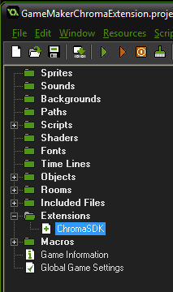
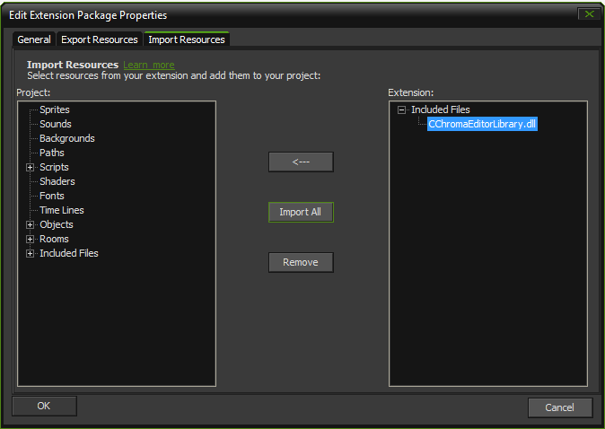
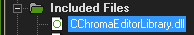
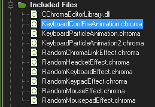

# GameMaker Chroma Extension - GameMaker Extension to control lighting for Razer Chroma

**Table of Contents**

* [Frameworks supported](#frameworks-supported)
* [Assets](#assets)
* [API](#api)

<a name="frameworks-supported"></a>
## Frameworks supported
- GameMaker 1.4
- Windows

<a name="getting-started"></a>
## Getting Started

1 Import the [GameMakerChromaExtension.gmez](https://github.com/razerofficial/GameMakerChromaExtension/releases/tag/GMS_1_4) extension

2 Double-click the `ChromaSDK` extension



3 On the `Import Resources` tab, expand `Included Files`, select `CChromaEditorLibrary.dll` and click `Import All`



4 `CChromaEditorLibrary.dll` should appear in your project's `Included Files` folder
 


5 Double-click a `Chroma` animation to associate the `.chroma` extension with the [CChromaEditor](https://github.com/RazerOfficial/CChromaEditor)



6 Once associated, double-click a `Chroma` animation to bring up the animation editor


<a name="assets"></a>
## Assets

This extension supports the `Chroma` animation exports from [UE4](https://github.com/razerofficial/UE4ChromaSDK), [Unity](https://github.com/razerofficial/UnityNativeChromaSDK/), and [GameMaker](https://github.com/razerofficial/GameMakerChromaExtension).

Add `Chroma` animation files to the project's `Included Files` to make the animations accessible from `GMS` script.


<a name="api"></a>
## API

The extension methods are only available on the `Windows` platform. Use `GMS` to detect the `Windows` os.

```
if (os_type == os_windows)
{
   // do Chroma
}
```

When the first room loads, run GMS script to set the default values for some global variables. These globals will be used to call `Chroma` DLL methods.

```
// init globals
global.PluginIsDialogOpen = -1;
global.PluginOpenEditorDialog = -1;
global.PluginOpenAnimation = -1;
global.PluginPlayAnimation = -1;
global.PluginStopAnimation = -1;
```

The API has various methods with the `D` suffix where `double` return-type/parameters were used. This is to support engines like `GameMaker` which have a limited number of data-types.

**PluginIsInitialized**

Returns true if the plugin has been initialized. Returns false if the plugin is uninitialized.

```C++
extern "C" EXPORT_API double PluginIsInitializedD();
```

**PluginIsDialogOpen**

The editor dialog is a non-blocking modal window, this method returns true if the modal window is open, otherwise false.

```C++
extern "C" EXPORT_API double PluginIsDialogOpenD();
```

**PluginOpenEditorDialog**

Opens a `Chroma` animation file with the `.chroma` extension. Returns zero upon success. Returns -1 if there was a failure.

```C++
extern "C" EXPORT_API double PluginOpenEditorDialogD(char* path);
```


**PluginOpenAnimation**

Opens a `Chroma` animation file so that it can be played. Returns an animation id >= 0 upon success. Returns -1 if there was a failure. The animation id is used in most of the API methods.

`DLL`

```C++
extern "C" EXPORT_API double PluginOpenAnimationD(char* path);
```

`GMS`

```
// check if the plugin method has been set globally
if (global.PluginOpenAnimation == -1)
{
    global.PluginOpenAnimation = external_define('CChromaEditorLibrary.dll', 'PluginOpenAnimationD', dll_cdecl, ty_real, 1, ty_string);
}

// open animation
return external_call(global.PluginOpenAnimation, 'RandomChromaLinkEffect.chroma');
```

**PluginLoadAnimation**

Loads `Chroma` effects so that the animation can be played immediately. Returns the animation id upon success. Returns -1 upon failure.

```C++
extern "C" EXPORT_API double PluginLoadAnimationD(double animationId);
```

**PluginUnloadAnimation**

Unloads `Chroma` effects to free up resources. Returns the animation id upon success. Returns -1 upon failure.

```C++
extern "C" EXPORT_API double PluginUnloadAnimationD(double animationId);
```

**PluginPlayAnimation**

Plays the `Chroma` animation. This will load the animation, if not loaded previously. Returns the animation id upon success. Returns -1 upon failure.

`DLL`

```C++
extern "C" EXPORT_API double PluginPlayAnimationD(double animationId);
```

`GMS`

```
// check if the plugin method has been set globally
if (global.PluginPlayAnimation == -1)
{
    global.PluginPlayAnimation = external_define('CChromaEditorLibrary.dll', 'PluginPlayAnimationD', dll_cdecl, ty_real, 1, ty_real);
}

// play animation
return external_call(global.PluginPlayAnimation, animationId);
```

**PluginStopAnimation**

Stops animation playback if in progress. Returns the animation id upon success. Returns -1 upon failure.

`DLL`

```C++
extern "C" EXPORT_API double PluginStopAnimationD(double animationId);
```

`GMS`

```
// check if the plugin method has been set globally
if (global.PluginStopAnimation == -1)
{
    global.PluginStopAnimation = external_define('CChromaEditorLibrary.dll', 'PluginStopAnimationD', dll_cdecl, ty_real, 1, ty_real);
}

// stop the animation
return external_call(global.PluginStopAnimation, animationId);
```

**PluginCloseAnimation**

Closes the `Chroma` animation to free up resources. Returns the animation id upon success. Returns -1 upon failure. This might be used while authoring effects if there was a change necessitating re-opening the animation. The animation id can no longer be used once closed.

```C++
extern "C" EXPORT_API double PluginCloseAnimationD(double animationId);
```

Uninitializes the `ChromaSDK`. Returns 0 upon success. Returns -1 upon failure.

```C++
extern "C" EXPORT_API double PluginUninitD();
```
